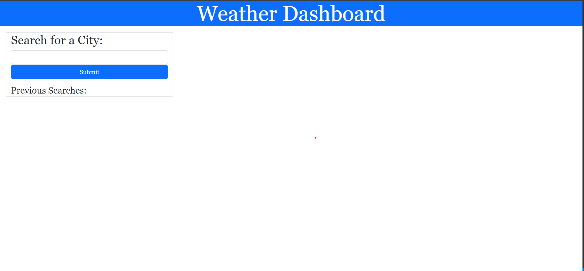
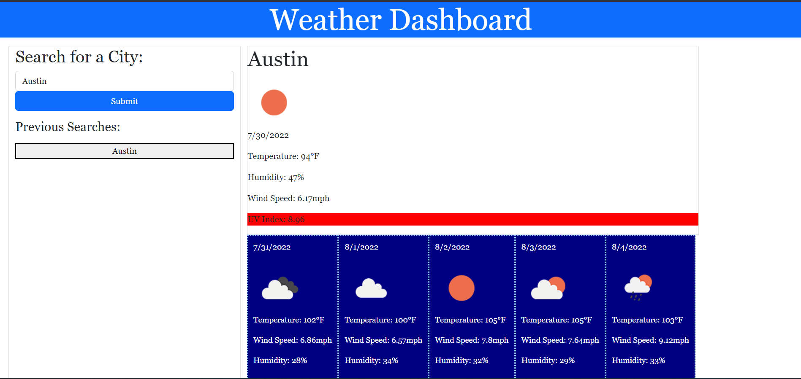

# Challenge06 - Weather Dashboard
<h1>Description</h1> 
Hello and welcome to challenge number 6 where the task was to build a weather dashboard that will run in the browser and will display a dynamically updated HTML.
At first you will just a simple landing page as seen below.
<!-- Needed a line between -->
  

Now for a search example I will search for Austin,TX and the page will display the current weather. It will show if its cloudy, sunny, thunderstorms etc. 
It will also display the current date, the temperature, humidity, wind speed and a UV index which will display one of 3 colors (red, yellow, green) based on how high or how low it is. (Texas folks use sun screen!) In addition to that, it will also display the next 5 days of the forecast.

 

<h1>Credits</h1> 
<li>https://getbootstrap.com/</li>
<li>Youtube tutorials</li>
<li>Bootstrap questions</li>

<h1>Live page</h1> 
Live deployed version of the site can be found at https://tekdahl92.github.io/Challenge06/
